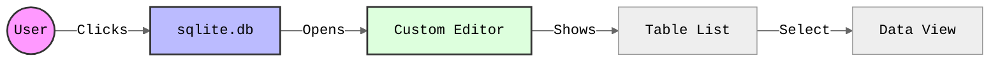

# SQLite Viewer

**Professional SQLite Database Management for VS Code**

> **Graphics Note:** Visual assets for this project are designed using **Nano Banana Pro**.

VS Code extension to view and manipulate SQLite database files with ease. Designed for developers who need quick access to their data without leaving their editor.

### Extension Workflow

> **Note:** Screenshots coming soon! Please add `demo.png` and `editor_view.png` to the `images` folder.

## Table of Contents

- [Features](#features)
- [Installation](#installation)
- [Usage](#usage)
- [Architecture](#architecture)
- [Troubleshooting](#troubleshooting)
- [Roadmap](#roadmap)
- [Ethics & Governance](#ethics--governance)
- [Privacy Policy](#privacy-policy)
- [Contributing](#contributing)
- [License](#license)

## Features

- **View SQLite Files**: Open `.sqlite`, `.db`, and `.sqlite3` files directly in VS Code by clicking on them in the explorer.
- **Table Viewer**: Inspect tables and their data in a modern, responsive webview.
- **Schema Inspection**: View database schema and structure to understand your data model.
- **SQL Execution**: (Coming Soon) Run custom SQL queries directly from the interface.

### UI Mockup

```mermaid
%%{init: {'theme': 'base', 'themeVariables': { 'primaryColor': '#ffcc00', 'edgeLabelBackground':'#ffffff', 'tertiaryColor': '#fff'}}}%%
graph TD
    subgraph VSCode["VS Code Window"]
        direction TB
        Title["SQLite Viewer: my_database.db"]

        subgraph Split["Main Area"]
            direction LR

            subgraph Sidebar["Sidebar (Tables)"]
                direction TB
                T1["📄 users_table"]
                T2["📄 orders_table"]
                T3["📄 products"]
                T4["⚙️ settings"]
            end

            subgraph Content["Data View Panel"]
                direction TB
                Query["🔍 SELECT * FROM users_table..."]

                subgraph Grid["Result Grid"]
                    Header["id | username | email      | role "]
                    Row1["1  | admin    | adm@loc.al | super"]
                    Row2["2  | user1    | usr@loc.al | user "]
                    Row3["3  | guest    | gst@loc.al | guest"]
                end
            end
        end

        Title --> Split
        Sidebar --> Content
    end

    style VSCode fill:#2d2d2d,stroke:#fff,color:#fff
    style Sidebar fill:#252526,stroke:#3e3e42,color:#ccc
    style Content fill:#1e1e1e,stroke:#3e3e42,color:#ccc
    style Query fill:#3c3c3c,stroke:#3e3e42,color:#fff
    style Grid fill:#1e1e1e,stroke:#444,color:#aaa
```

## Installation

1. Open **Visual Studio Code**.
2. Go to the **Extensions** view (`Ctrl+Shift+X` or `Cmd+Shift+X`).
3. Search for "SQLite Viewer".
4. Click **Install**.
   *(Note: Until published to the Marketplace, you can clone this repo and run `F5` to test)*

## Usage

1. **Open a Database**: Locate a `.sqlite`, `.db`, or `.sqlite3` file in your file explorer.
2. **Click to Open**: The extension automatically registers as a custom editor for these file types.
3. **Explore Data**:
    - Use the sidebar to navigate between tables.
    - View the schema and data in the main view.

## Architecture

This extension uses VS Code's `CustomReadonlyEditorProvider` API.

### System Design

- **Frontend**: A Webview populated with HTML/CSS/JS that communicates with the extension host.
- **Backend**: The extension host reads the SQLite file from disk and sends data to the Webview.
- **Security**: The Webview is sandboxed and only allows scripts defined by the extension.

### Data Flow

## Troubleshooting

- **File not opening?** Ensure the file extension is supported (`.db`, `.sqlite`, `.sqlite3`). You can right-click the file and select "Open With..." -> "SQLite Viewer".
- **Large files:** Opening very large database files (> 100MB) might be slow initially as we optimize data loading.

## Roadmap

- [x] Basic File Viewer
- [ ] Execute SQL Queries
- [ ] SQL File Support (.sql)
- [ ] Data Editing
- [ ] Export Data

## Ethics & Governance

This project adheres to the ethical development standards defined in our [AI Dev Tasks](https://github.com/FutureTranz-Inc/ai-dev-tasks) framework. We are committed to:
- Transparency in our development process.
- Responsible use of automation and AI.
- Ensuring user data privacy (this extension runs entirely locally).

## Privacy Policy

Your privacy is important to us.
- **Local Only:** This extension operates entirely on your local machine.
- **No Data Collection:** We do not collect or transmit any of your database content or personal information.
- See the full [Privacy Policy](PRIVACY.md).

## Contributing

We welcome contributions! Please see [CONTRIBUTING.md](CONTRIBUTING.md) for details on code of conduct and the pull request process.

## License

This project is licensed under the [MIT License](LICENSE).
Free and open source for personal and commercial use.
